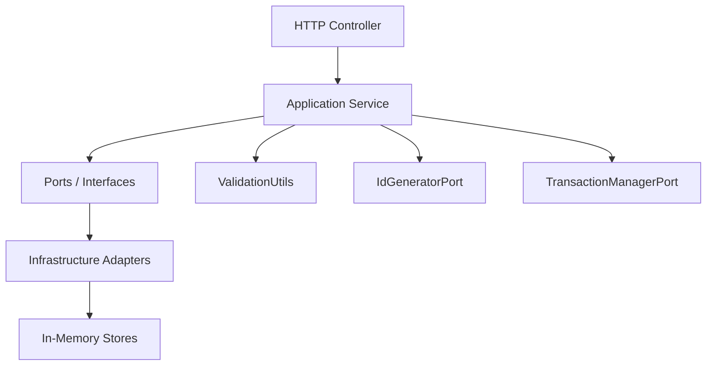

# 01-architecture-overview.md

## DDL 判定块
- Decision: No
- Evidence:
    1) iam-service/iam-model/src/main/java/com/tenghe/corebackend/model/Organization.java | Organization | PO 无表名/列类型注解 | L1-L20
    2) iam-service/iam-model/src/main/java/com/tenghe/corebackend/model/User.java | User | PO 无表名/列类型注解 | L1-L19
    3) iam-service/iam-model/src/main/java/com/tenghe/corebackend/model/RoleGrant.java | RoleGrant | PO 无表名/列类型注解 | L1-L17
    4) iam-service/iam-model/src/main/java/com/tenghe/corebackend/model/OrganizationApp.java | OrganizationApp | PO 无表名/列类型注解 | L1-L11
    5) iam-service/iam-model/src/main/java/com/tenghe/corebackend/model/OrgMembership.java | OrgMembership | PO 无表名/列类型注解 | L1-L13
    6) iam-service/iam-model/src/main/java/com/tenghe/corebackend/model/ExternalMembership.java | ExternalMembership | PO 无表名/列类型注解 | L1-L14
- Excluded（若有）：
    - 无

## 文件清单
- 01-architecture-overview.md：架构与分层概览、模块关系与总览说明。
- 02-api-reference.md：HTTP 入口清单与请求/响应/错误/副作用说明。
- 03-domain-model.md：领域对象与关系、关键业务概念。
- 04-data-model.md：PO 字段与数据结构清单（非 DDL）。
- 05-key-flows.md：关键业务流程与调用链追踪。
- 06-prd-lite.md：基于现有代码的轻量需求说明。
- 07-iteration-backlog.md：后续迭代清单与缺口记录。
- 08-test-plan.md：测试范围与用例清单。
- 09-runbook.md：运行与排障手册。
- 10-ddl-reference.sql：未生成（Decision=No）。
- 11-prompt-pack.md：增量更新模板与回归检查。
- 12-self-verification-report.md：自证检查与 PASS/FAIL。

## 系统概述
- 本工程为 Maven 多模块项目，根模块聚合 `iam-service`，后者再拆分为 model/api/interfaces/application/infrastructure/controller/main 七个子模块，用于体现 DDD-lite + 六边形分层（入口层、用例层、端口层、适配器层、模型层、启动层）。
- 运行时入口为 Spring Boot 应用 `CoreBackendApplication`，以 Web 接口为主要入口。

## 模块与职责
- `iam-model`: 领域对象与枚举（Organization/User/RoleGrant 等）。
- `iam-api`: 对外 DTO（请求/响应）与通用响应包装 `ApiResponse`、分页 `PageResponse`。
- `iam-interfaces`: Repository/IdGenerator/Transaction 等端口抽象。
- `iam-application`: 组织与成员相关用例服务（校验、事务边界、调用端口）。
- `iam-infrastructure`: 端口实现（内存仓库、雪花 ID、事务管理）。
- `iam-controller`: Web Controller 与异常处理。
- `iam-main`: Spring Boot 启动模块与配置。

## 主要调用链
- HTTP 请求 → Controller（DTO 转换） → ApplicationService（校验/业务流程） → Ports（Repository/ID/Transaction） → InMemory 适配器。
- 全局异常由 `GlobalExceptionHandler` 将 `BusinessException` 映射为 400，将未知异常映射为 500。

## 存储与基础设施
- 当前仓库实现为内存存储（ConcurrentHashMap），未发现持久化数据库实现。
- ID 生成使用雪花算法实现；事务边界通过本地锁进行串行化。

## Evidence
- iam-service/pom.xml | modules | 声明 7 个子模块 | L16-L24
- pom.xml | modules | 根模块聚合 iam-service | L21-L23
- iam-main/src/main/java/com/tenghe/corebackend/CoreBackendApplication.java | CoreBackendApplication | Spring Boot 启动入口 | L6-L11
- iam-controller/src/main/java/com/tenghe/corebackend/controller/web/OrganizationController.java | OrganizationController | HTTP 入口示例 | L36-L139
- iam-controller/src/main/java/com/tenghe/corebackend/controller/web/MemberController.java | MemberController | HTTP 入口示例 | L36-L149
- iam-controller/src/main/java/com/tenghe/corebackend/controller/web/GlobalExceptionHandler.java | GlobalExceptionHandler | 异常映射为 ApiResponse | L10-L20
- iam-application/src/main/java/com/tenghe/corebackend/application/service/OrganizationApplicationService.java | OrganizationApplicationService | 应用服务层（组织用例） | L38-L239
- iam-application/src/main/java/com/tenghe/corebackend/application/service/MemberApplicationService.java | MemberApplicationService | 应用服务层（成员用例） | L40-L309
- iam-interfaces/src/main/java/com/tenghe/corebackend/interfaces/OrganizationRepositoryPort.java | OrganizationRepositoryPort | 仓储端口示例 | L1-L17
- iam-infrastructure/src/main/java/com/tenghe/corebackend/infrastructure/inmemory/InMemoryOrganizationRepository.java | InMemoryOrganizationRepository | 内存仓库实现 | L11-L67
- iam-infrastructure/src/main/java/com/tenghe/corebackend/infrastructure/inmemory/LocalTransactionManager.java | LocalTransactionManager | 本地事务管理 | L6-L15
- iam-infrastructure/src/main/java/com/tenghe/corebackend/infrastructure/snowflake/SnowflakeIdGenerator.java | SnowflakeIdGenerator | 雪花 ID 生成器 | L6-L52
- iam-main/src/main/resources/application.properties | server.port | Web 端口配置 | L1-L2

## UNKNOWN/ASSUMED
- AuthN/AuthZ 机制 UNKNOWN：未发现安全配置或拦截器的代码证据。
- 持久化数据库与 ORM 框架 UNKNOWN：当前仅看到内存仓库实现。
- 外部服务调用/消息队列/缓存一致性 UNKNOWN：未发现相关适配器或配置。
- 生产环境部署与运行脚本 UNKNOWN：未找到 README/脚本描述。
