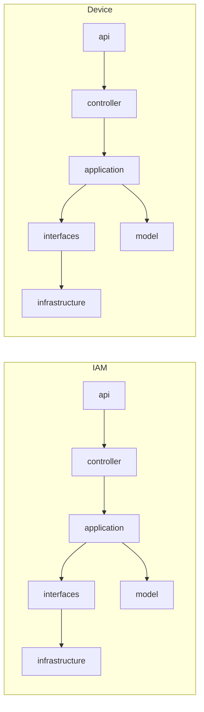

# 01-architecture-overview.md

## 系统范围

- 本仓库包含两个独立 Spring Boot 服务：IAM（身份与组织/权限域）与 Device（设备模型与设备资产域）。
- 两个服务均采用分模块结构：model/api/interfaces/application/infrastructure/controller/main。

## Rebuild Report

- 本次采用 REBUILD：docs/01-12 目录为空，需全量生成。ASSUMED

## 分层与模块

- model：领域模型与枚举。
- api：对外 DTO（请求/响应）。
- interfaces：出站端口（Repository/外部服务/工具）。
- application：用例编排与校验。
- infrastructure：端口实现（MyBatis、内存服务、Snowflake 等）。
- controller：HTTP 入口。
- main：Spring Boot 启动与 Mapper 扫描。

## 运行时组件

- 持久化：MyBatis + MySQL（两服务各自配置数据源）。
- JSON 编解码：Jackson（用于组织描述/用户属性/设备动态属性/设备模型点枚举等）。
- 内存实现：Token、Captcha、Email、EmailCode、Telemetry 等均提供 InMemory 版本。

## 统一响应与异常

- IAM 响应包装：`code/message/data`，成功 `code="0"`，失败 `code="500"`。
- Device 响应包装：`success/message/data`，成功 `success=true`。
- 全局异常：BusinessException -> HTTP 400；未捕获异常 -> HTTP 500（IAM: “系统异常”，Device: “System error”）。

## 关键技术/数据特性

- ID 生成：Snowflake（应用层通过 IdGeneratorPort 生成）。
- 软删除：模型层均包含 deleted 标记，删除流程使用 soft delete/更新 deleted 字段。
- JSON 承载扩展字段：
    - 组织描述字段在持久化时承载描述 + 联系人 + 管理员展示名。
    - 用户 attributes 字段承载初始密码标记、失败次数、锁定时间、账号类型。
    - 设备 dynamicAttributes、产品 protocolMapping、设备模型点 enumItems 以 JSON 存储。

## 架构示意

## Evidence

- pom.xml | modules | 根聚合包含 iam-service 与 device-service | L23-L36
- /Users/sirgan/Downloads/CoreBackend/iam-service/pom.xml | modules | IAM
  子模块列表（model/api/interfaces/application/infrastructure/controller/main） | L15-L25
- /Users/sirgan/Downloads/CoreBackend/device-service/pom.xml | modules | Device
  子模块列表（model/api/interfaces/application/infrastructure/controller/main） | L15-L25
-
/Users/sirgan/Downloads/CoreBackend/iam-service/iam-main/src/main/java/com/tenghe/corebackend/iam/IamServiceApplication.java |
@SpringBootApplication | IAM 启动入口与 MapperScan | L8-L16
-
/Users/sirgan/Downloads/CoreBackend/device-service/device-main/src/main/java/com/tenghe/corebackend/device/DeviceServiceApplication.java |
@SpringBootApplication | Device 启动入口与 MapperScan | L7-L10
- /Users/sirgan/Downloads/CoreBackend/iam-service/iam-main/src/main/resources/application.yml |
  spring.datasource/mybatis | IAM 数据源与 MyBatis 配置 | L1-L11
- /Users/sirgan/Downloads/CoreBackend/device-service/device-main/src/main/resources/application.yml |
  spring.datasource/mybatis | Device 数据源与 MyBatis 配置 | L1-L11
-
/Users/sirgan/Downloads/CoreBackend/iam-service/iam-api/src/main/java/com/tenghe/corebackend/iam/api/dto/common/ApiResponse.java |
ApiResponse | IAM 响应结构与 code 语义 | L1-L28
-
/Users/sirgan/Downloads/CoreBackend/device-service/device-api/src/main/java/com/tenghe/corebackend/device/api/dto/common/ApiResponse.java |
ApiResponse | Device 响应结构与 success 语义 | L1-L23
-
/Users/sirgan/Downloads/CoreBackend/iam-service/iam-controller/src/main/java/com/tenghe/corebackend/iam/controller/web/GlobalExceptionHandler.java |
handleBusinessException/handleException | IAM 异常映射 HTTP 状态与消息 | L11-L29
-
/Users/sirgan/Downloads/CoreBackend/device-service/device-controller/src/main/java/com/tenghe/corebackend/device/controller/web/GlobalExceptionHandler.java |
handleBusinessException/handleException | Device 异常映射 HTTP 状态与消息 | L10-L20
-
/Users/sirgan/Downloads/CoreBackend/iam-service/iam-infrastructure/src/main/java/com/tenghe/corebackend/iam/infrastructure/snowflake/SnowflakeIdGenerator.java |
SnowflakeIdGenerator | IAM Snowflake ID 生成实现 | L6-L52
-
/Users/sirgan/Downloads/CoreBackend/device-service/device-infrastructure/src/main/java/com/tenghe/corebackend/device/infrastructure/snowflake/SnowflakeIdGenerator.java |
SnowflakeIdGenerator | Device Snowflake ID 生成实现 | L7-L52
-
/Users/sirgan/Downloads/CoreBackend/iam-service/iam-infrastructure/src/main/java/com/tenghe/corebackend/iam/infrastructure/persistence/repository/MyBatisOrganizationRepository.java |
encodeDescription/applyDescription | 组织描述字段复合 JSON | L94-L131
-
/Users/sirgan/Downloads/CoreBackend/iam-service/iam-infrastructure/src/main/java/com/tenghe/corebackend/iam/infrastructure/persistence/repository/MyBatisUserRepository.java |
buildAttributes/applyAttributes | 用户 attributes JSON 承载 | L130-L158
-
/Users/sirgan/Downloads/CoreBackend/device-service/device-infrastructure/src/main/java/com/tenghe/corebackend/device/infrastructure/persistence/repository/MyBatisDeviceRepository.java |
toModel/toPo | 设备 dynamicAttributes JSON 存取 | L93-L124
-
/Users/sirgan/Downloads/CoreBackend/device-service/device-infrastructure/src/main/java/com/tenghe/corebackend/device/infrastructure/persistence/repository/MyBatisProductRepository.java |
toModel/toPo | 产品 protocolMapping JSON 存取 | L67-L101
-
/Users/sirgan/Downloads/CoreBackend/device-service/device-infrastructure/src/main/java/com/tenghe/corebackend/device/infrastructure/persistence/repository/MyBatisDeviceModelRepository.java |
toPointModel/encodeEnumItems | 设备模型点 enumItems JSON 存取 | L126-L170
-
/Users/sirgan/Downloads/CoreBackend/iam-service/iam-infrastructure/src/main/java/com/tenghe/corebackend/iam/infrastructure/inmemory/InMemoryTokenService.java |
InMemoryTokenService | Token 内存实现 | L9-L54
-
/Users/sirgan/Downloads/CoreBackend/iam-service/iam-infrastructure/src/main/java/com/tenghe/corebackend/iam/infrastructure/inmemory/InMemoryCaptchaService.java |
InMemoryCaptchaService | Captcha 内存实现 | L9-L28
-
/Users/sirgan/Downloads/CoreBackend/iam-service/iam-infrastructure/src/main/java/com/tenghe/corebackend/iam/infrastructure/inmemory/InMemoryEmailService.java |
InMemoryEmailService | Email 内存实现 | L6-L13
-
/Users/sirgan/Downloads/CoreBackend/iam-service/iam-infrastructure/src/main/java/com/tenghe/corebackend/iam/infrastructure/inmemory/InMemoryEmailCodeService.java |
InMemoryEmailCodeService | EmailCode 内存实现 | L11-L55
-
/Users/sirgan/Downloads/CoreBackend/device-service/device-infrastructure/src/main/java/com/tenghe/corebackend/device/infrastructure/inmemory/InMemoryTelemetryRepository.java |
InMemoryTelemetryRepository | Telemetry 内存实现 | L11-L31

## UNKNOWN/ASSUMED

- UNKNOWN：未发现显式鉴权/鉴别过滤器或注解，AuthN/AuthZ 机制需结合运行配置确认。
- ASSUMED：图中分层依赖为模块间调用方向约定，实际强制依赖约束需结合构建/依赖配置验证。
