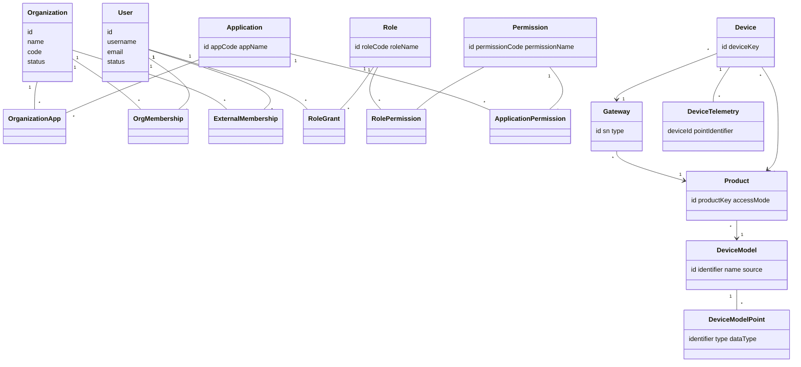

# 03-domain-model.md

## IAM 领域模型

### 核心实体

- Organization：组织边界，含名称、编码、状态、联系人与管理员展示名。
- User：平台用户，含登录凭据、状态、账号类型与主组织。
- Role：角色，隶属应用，包含编码/名称/状态/是否预置。
- Permission：权限，支持树形父子关系与类型。
- Application：应用实例，含编码、名称、状态。

### 关系与聚合

- Organization ↔ Application：通过 OrganizationApp 映射。
- Organization ↔ User（内部成员）：通过 OrgMembership。
- Organization ↔ User（外部成员）：通过 ExternalMembership。
- User ↔ Role：通过 RoleGrant（携带组织、应用与角色分类）。
- Role ↔ Permission：通过 RolePermission。
- Application ↔ Permission：通过 ApplicationPermission。

### 枚举

- OrganizationStatusEnum：NORMAL/DISABLED。
- UserStatusEnum：NORMAL/DISABLED。
- AccountTypeEnum：MANAGEMENT/APPLICATION。
- RoleStatusEnum：ENABLED/DISABLED。
- PermissionStatusEnum：ENABLED/DISABLED。
- PermissionTypeEnum：MENU/BUTTON。
- ApplicationStatusEnum：ENABLED/DISABLED。
- RoleCategoryEnum：MANAGEMENT/APPLICATION。

## Device 领域模型

### 核心实体

- DeviceModel：设备模型，支持继承（parentModelId）。
- DeviceModelPoint：模型测点，类型为 ATTRIBUTE/TELEMETRY。
- Product：产品，包含 productKey/productSecret、accessMode 与 protocolMapping。
- Gateway：网关实例，包含 type、sn、stationId 与 enabled。
- Device：设备实例，绑定 Product 与 Gateway，包含 dynamicAttributes。
- DeviceTelemetry：设备遥测最新值。

### 枚举

- DeviceModelSource：NEW/INHERIT。
- DevicePointType：ATTRIBUTE/TELEMETRY。
- DeviceDataType：INT/FLOAT/DOUBLE/STRING/ENUM/BOOL/DATETIME。
- ProductType：DEVICE/GATEWAY。
- GatewayType：EDGE/VIRTUAL。
- GatewayStatus：ONLINE/OFFLINE。
- DeviceStatus：ONLINE/OFFLINE。

## 关系示意

## Evidence

-
/Users/sirgan/Downloads/CoreBackend/iam-service/iam-model/src/main/java/com/tenghe/corebackend/iam/model/Organization.java |
Organization | 组织字段 | L8-L21
- /Users/sirgan/Downloads/CoreBackend/iam-service/iam-model/src/main/java/com/tenghe/corebackend/iam/model/User.java |
  User | 用户字段 | L9-L25
- /Users/sirgan/Downloads/CoreBackend/iam-service/iam-model/src/main/java/com/tenghe/corebackend/iam/model/Role.java |
  Role | 角色字段 | L8-L20
-
/Users/sirgan/Downloads/CoreBackend/iam-service/iam-model/src/main/java/com/tenghe/corebackend/iam/model/Permission.java |
Permission | 权限字段 | L9-L20
-
/Users/sirgan/Downloads/CoreBackend/iam-service/iam-model/src/main/java/com/tenghe/corebackend/iam/model/Application.java |
Application | 应用字段 | L8-L17
-
/Users/sirgan/Downloads/CoreBackend/iam-service/iam-model/src/main/java/com/tenghe/corebackend/iam/model/OrganizationApp.java |
OrganizationApp | 组织-应用映射 | L6-L11
-
/Users/sirgan/Downloads/CoreBackend/iam-service/iam-model/src/main/java/com/tenghe/corebackend/iam/model/OrgMembership.java |
OrgMembership | 组织成员关系 | L8-L13
-
/Users/sirgan/Downloads/CoreBackend/iam-service/iam-model/src/main/java/com/tenghe/corebackend/iam/model/ExternalMembership.java |
ExternalMembership | 外部成员关系 | L8-L14
-
/Users/sirgan/Downloads/CoreBackend/iam-service/iam-model/src/main/java/com/tenghe/corebackend/iam/model/RoleGrant.java |
RoleGrant | 用户角色授权 | L8-L19
-
/Users/sirgan/Downloads/CoreBackend/iam-service/iam-model/src/main/java/com/tenghe/corebackend/iam/model/RolePermission.java |
RolePermission | 角色权限 | L8-L14
-
/Users/sirgan/Downloads/CoreBackend/iam-service/iam-model/src/main/java/com/tenghe/corebackend/iam/model/ApplicationPermission.java |
ApplicationPermission | 应用权限 | L8-L14
-
/Users/sirgan/Downloads/CoreBackend/iam-service/iam-model/src/main/java/com/tenghe/corebackend/iam/model/enums/OrganizationStatusEnum.java |
OrganizationStatusEnum | 组织状态枚举 | L3-L5
-
/Users/sirgan/Downloads/CoreBackend/iam-service/iam-model/src/main/java/com/tenghe/corebackend/iam/model/enums/UserStatusEnum.java |
UserStatusEnum | 用户状态枚举 | L3-L5
-
/Users/sirgan/Downloads/CoreBackend/iam-service/iam-model/src/main/java/com/tenghe/corebackend/iam/model/enums/AccountTypeEnum.java |
AccountTypeEnum | 账号类型枚举 | L3-L5
-
/Users/sirgan/Downloads/CoreBackend/iam-service/iam-model/src/main/java/com/tenghe/corebackend/iam/model/enums/RoleStatusEnum.java |
RoleStatusEnum | 角色状态枚举 | L3-L5
-
/Users/sirgan/Downloads/CoreBackend/iam-service/iam-model/src/main/java/com/tenghe/corebackend/iam/model/enums/PermissionStatusEnum.java |
PermissionStatusEnum | 权限状态枚举 | L3-L5
-
/Users/sirgan/Downloads/CoreBackend/iam-service/iam-model/src/main/java/com/tenghe/corebackend/iam/model/enums/PermissionTypeEnum.java |
PermissionTypeEnum | 权限类型枚举 | L3-L5
-
/Users/sirgan/Downloads/CoreBackend/iam-service/iam-model/src/main/java/com/tenghe/corebackend/iam/model/enums/ApplicationStatusEnum.java |
ApplicationStatusEnum | 应用状态枚举 | L3-L5
-
/Users/sirgan/Downloads/CoreBackend/iam-service/iam-model/src/main/java/com/tenghe/corebackend/iam/model/enums/RoleCategoryEnum.java |
RoleCategoryEnum | 角色分类枚举 | L3-L5
-
/Users/sirgan/Downloads/CoreBackend/device-service/device-model/src/main/java/com/tenghe/corebackend/device/model/DeviceModel.java |
DeviceModel | 设备模型字段 | L8-L18
-
/Users/sirgan/Downloads/CoreBackend/device-service/device-model/src/main/java/com/tenghe/corebackend/device/model/DeviceModelPoint.java |
DeviceModelPoint | 测点字段 | L7-L14
-
/Users/sirgan/Downloads/CoreBackend/device-service/device-model/src/main/java/com/tenghe/corebackend/device/model/Product.java |
Product | 产品字段 | L8-L20
-
/Users/sirgan/Downloads/CoreBackend/device-service/device-model/src/main/java/com/tenghe/corebackend/device/model/Gateway.java |
Gateway | 网关字段 | L8-L19
-
/Users/sirgan/Downloads/CoreBackend/device-service/device-model/src/main/java/com/tenghe/corebackend/device/model/Device.java |
Device | 设备字段 | L8-L21
-
/Users/sirgan/Downloads/CoreBackend/device-service/device-model/src/main/java/com/tenghe/corebackend/device/model/DeviceTelemetry.java |
DeviceTelemetry | 遥测字段 | L8-L13
-
/Users/sirgan/Downloads/CoreBackend/device-service/device-model/src/main/java/com/tenghe/corebackend/device/model/DeviceModelSource.java |
DeviceModelSource | 模型来源枚举 | L3-L5
-
/Users/sirgan/Downloads/CoreBackend/device-service/device-model/src/main/java/com/tenghe/corebackend/device/model/DevicePointType.java |
DevicePointType | 点类型枚举 | L3-L5
-
/Users/sirgan/Downloads/CoreBackend/device-service/device-model/src/main/java/com/tenghe/corebackend/device/model/DeviceDataType.java |
DeviceDataType | 数据类型枚举 | L3-L10
-
/Users/sirgan/Downloads/CoreBackend/device-service/device-model/src/main/java/com/tenghe/corebackend/device/model/ProductType.java |
ProductType | 产品类型枚举 | L3-L5
-
/Users/sirgan/Downloads/CoreBackend/device-service/device-model/src/main/java/com/tenghe/corebackend/device/model/GatewayType.java |
GatewayType | 网关类型枚举 | L3-L5
-
/Users/sirgan/Downloads/CoreBackend/device-service/device-model/src/main/java/com/tenghe/corebackend/device/model/GatewayStatus.java |
GatewayStatus | 网关状态枚举 | L3-L5
-
/Users/sirgan/Downloads/CoreBackend/device-service/device-model/src/main/java/com/tenghe/corebackend/device/model/DeviceStatus.java |
DeviceStatus | 设备状态枚举 | L3-L5

## UNKNOWN/ASSUMED

- UNKNOWN：组织/用户等字段的业务约束（如唯一性范围、长度）在模型层未标注，需结合应用层校验与数据库约束确认。
- ASSUMED：图中关系为基于模型字段与仓储使用的逻辑关系，实际外键约束需以数据库定义为准。
