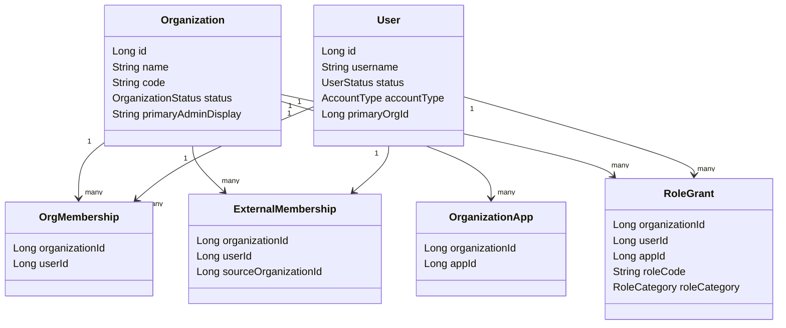

# 03-domain-model.md

## 领域概念
### Organization（组织）
- 核心组织实体，包含名称、编码、状态、管理员显示名与联系人信息。
- 状态枚举 `OrganizationStatus`：NORMAL/DISABLED。

### User（用户）
- 系统用户，包含用户名、姓名、联系方式、账号状态与账号类型。
- 账号类型枚举 `AccountType`：MANAGEMENT/APPLICATION。
- 账号状态枚举 `UserStatus`：NORMAL/DISABLED。

### OrgMembership（内部成员关系）
- 组织与用户的内部成员关系，支持软删除。

### ExternalMembership（外部成员关系）
- 组织与外部用户的关联关系，记录来源组织。

### OrganizationApp（组织-应用映射）
- 组织可使用应用 ID 的关联集合。

### RoleGrant（角色授权）
- 用户在某组织与应用下的角色授权记录。
- `RoleCategory` 区分管理端/应用端授权。
- 组织管理员使用 roleCode `ORG_ADMIN`。

## 关键业务规则（来自代码）
- 组织名称必填且长度不超过 50；名称重复时抛出“该组织名称已被占用”。
- 组织编码必填且需匹配 `^[A-Za-z0-9_]+$`；编码重复时抛出“组织编码已被占用”。
- 组织更新时状态必须能解析为 `OrganizationStatus`。
- 创建内部成员时：用户名必填且为字母数字组合；手机/邮箱至少填写一项；关联组织与角色必填；关联角色必须属于关联组织的应用。
- 外部成员关联时：不能关联本组织成员；已关联外部成员会被拒绝；用户无归属组织会被拒绝。
- 组织管理员显示名校验：仅允许字母数字，长度 1-20。

## Evidence
- iam-service/iam-model/src/main/java/com/tenghe/corebackend/model/Organization.java | Organization | 组织实体字段 | L1-L20
- iam-service/iam-model/src/main/java/com/tenghe/corebackend/model/User.java | User | 用户实体字段 | L1-L19
- iam-service/iam-model/src/main/java/com/tenghe/corebackend/model/OrgMembership.java | OrgMembership | 内部成员关系 | L1-L13
- iam-service/iam-model/src/main/java/com/tenghe/corebackend/model/ExternalMembership.java | ExternalMembership | 外部成员关系 | L1-L14
- iam-service/iam-model/src/main/java/com/tenghe/corebackend/model/OrganizationApp.java | OrganizationApp | 组织应用映射 | L1-L11
- iam-service/iam-model/src/main/java/com/tenghe/corebackend/model/RoleGrant.java | RoleGrant | 角色授权 | L1-L17
- iam-service/iam-model/src/main/java/com/tenghe/corebackend/model/OrganizationStatus.java | OrganizationStatus | 组织状态枚举 | L1-L18
- iam-service/iam-model/src/main/java/com/tenghe/corebackend/model/UserStatus.java | UserStatus | 用户状态枚举 | L1-L18
- iam-service/iam-model/src/main/java/com/tenghe/corebackend/model/AccountType.java | AccountType | 账号类型枚举 | L1-L18
- iam-service/iam-application/src/main/java/com/tenghe/corebackend/application/service/OrganizationApplicationService.java | createOrganization/updateOrganization | 组织校验与状态更新规则 | L90-L182
- iam-service/iam-application/src/main/java/com/tenghe/corebackend/application/service/MemberApplicationService.java | createInternalMember/linkExternalMember | 成员校验与关联规则 | L99-L304
- iam-service/iam-application/src/main/java/com/tenghe/corebackend/application/validation/ValidationUtils.java | ValidationUtils | 校验规则定义 | L7-L72

## UNKNOWN/ASSUMED
- 组织与应用（appId）的真实业务含义 UNKNOWN：未见应用实体或字典定义。
- 角色编码与角色库的来源 UNKNOWN：仅发现 `roleCode` 字段与 ORG_ADMIN 常量写入。
- 组织管理员职责与权限范围 UNKNOWN：仅见角色授权写入逻辑。
